# TpClinica

**Página Web:** [https://tpclinica-1845c.web.app](https://tpclinica-1845c.web.app)

---

## Pantalla de Login

  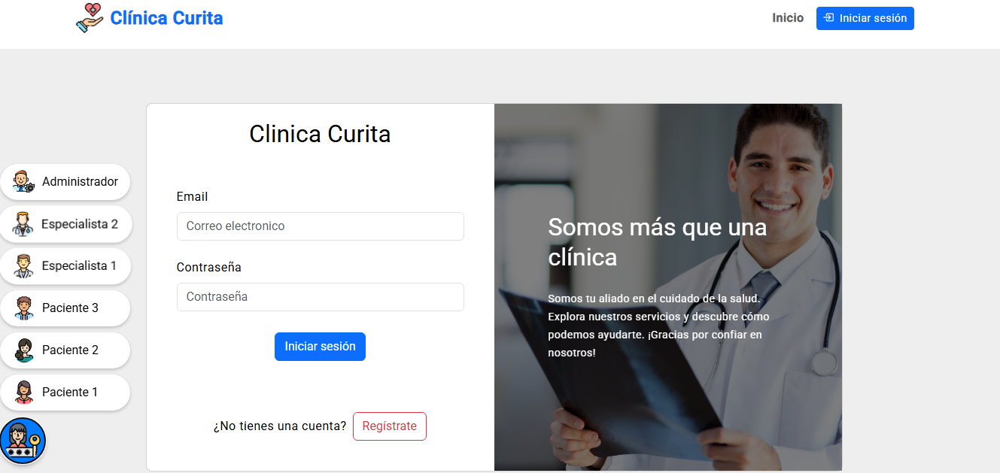

**Descripción:**  
Permite al usuario ingresar con email y contraseña para acceder a la aplicación.

**Componentes y Elementos:**

- Formulario con campos: email y contraseña.
- Botón de ingreso.
- Mensajes de error si las credenciales son inválidas.
- 6 botones de acceso rápido:
  - 2 especialistas
  - 1 administrador
  - 3 pacientes

---

## Pantalla de Registro de Usuario

  <b>Seleccion de rol</b>

  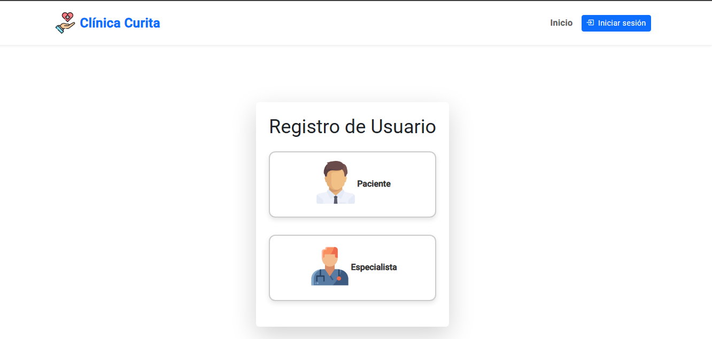

  <b>Paciente</b>

  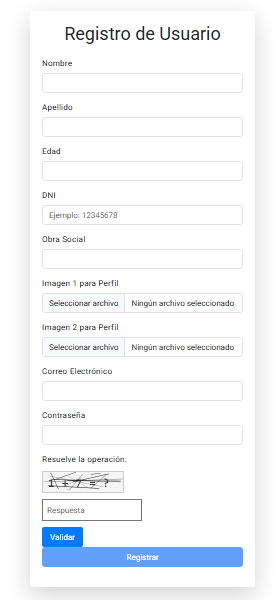

  <b>Especialista</b>

  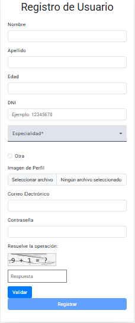

**Descripción:**  
Pantalla donde el usuario puede registrarse como Paciente o Especialista, completando datos personales y específicos según el tipo.

**Componentes y Elementos:**

- Selector de tipo de usuario (Paciente o Especialista).
- Formulario reactivo con campos: nombre, apellido, edad, DNI, email, contraseña.
- Campos específicos para paciente: obra social, dos imágenes de perfil.
- Campos específicos para especialista: especialidades (multi-select), checkbox para agregar otra, imagen de perfil.
- Componente Captcha para validación humana.
- Botón "Registrar" que solo se habilita si el formulario es válido y el captcha fue resuelto correctamente.

**Funcionalidades:**

- Validaciones en cada campo (obligatorio, formato, números mayores a 0, etc).
- Validación dinámica de campos según el tipo de usuario seleccionado.
- Permite cargar imágenes para el perfil.
- Integración con componente captcha para evitar registros automatizados.

**Integraciones y Eventos:**

- Envío del formulario a función `agregarUsuario()` que procesa los datos.
- Uso de Reactive Forms para control de validación.
- Comunicación con componente `<app-captcha>` para validar respuesta humana.

---

## Pantalla de Bienvenida

  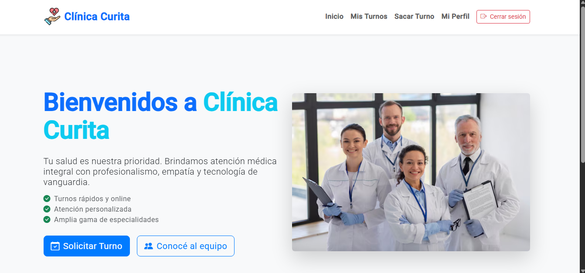

  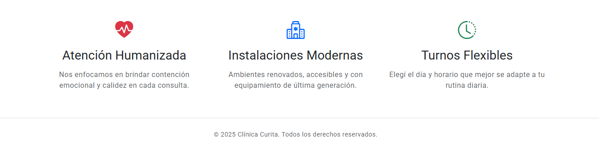

**Descripción:**  
Pantalla inicial que recibe al usuario y presenta la app. Sirve como punto de partida para navegar a login o registro.

**Componentes y Elementos:**

- Mensaje de bienvenida.
- Botones o enlaces para ir a Login o Registro.

**Funcionalidades:**

- Redirecciona al usuario según la acción seleccionada (login o registro).
- Puede incluir animaciones o mensajes dinámicos.

**Integraciones y Eventos:**

- Navegación a rutas internas (login, registro).

---

## Pantalla de Usuarios (Administración)

  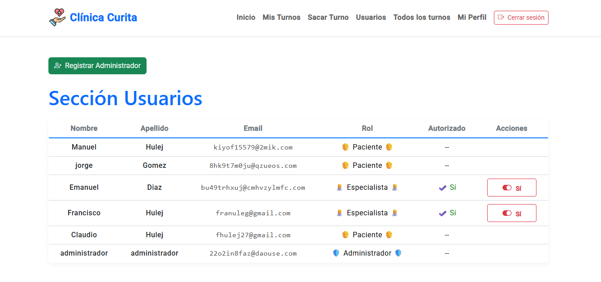

**Descripción:**  
Pantalla exclusiva para el administrador donde puede gestionar usuarios, incluyendo registrar nuevos administradores y validar acceso de otros usuarios.

**Componentes y Elementos:**

- Tabla/lista de usuarios registrados con detalles básicos.
- Formulario para registrar nuevos administradores.
- Botones para validar, activar o desactivar usuarios.
- Filtros o búsqueda para facilitar la gestión.

**Funcionalidades:**

- Registro de nuevos administradores con validaciones.
- Validación manual usuarios existentes.
- Visualización de estado y roles de usuarios.

---

## Pantalla: Sacar Turno

  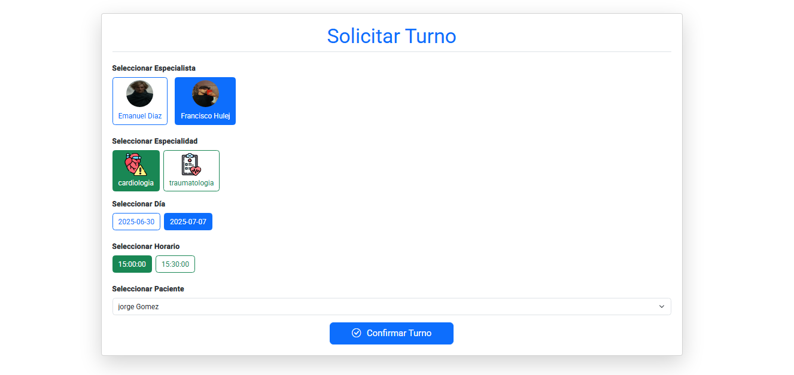

### Descripción

Formulario para que pacientes o administradores puedan solicitar turnos con especialistas.

### Componentes y Elementos

- Select de especialidad y especialista (dinámicos).
- Botones para seleccionar día y horario.
- Si el usuario es administrador, se muestra un select para elegir el paciente.

### Funcionalidades

- Muestra solo los días y horarios disponibles según la disponibilidad del especialista y turnos ya tomados.
- Formulario reactivo con validaciones.
- Envío de datos a Supabase y mensaje de confirmación.
- Si el usuario es Administrador selecciona el paciente al cual sacarle turno.

---

## Pantalla: Mis Turnos

  <b>Paciente</b>

  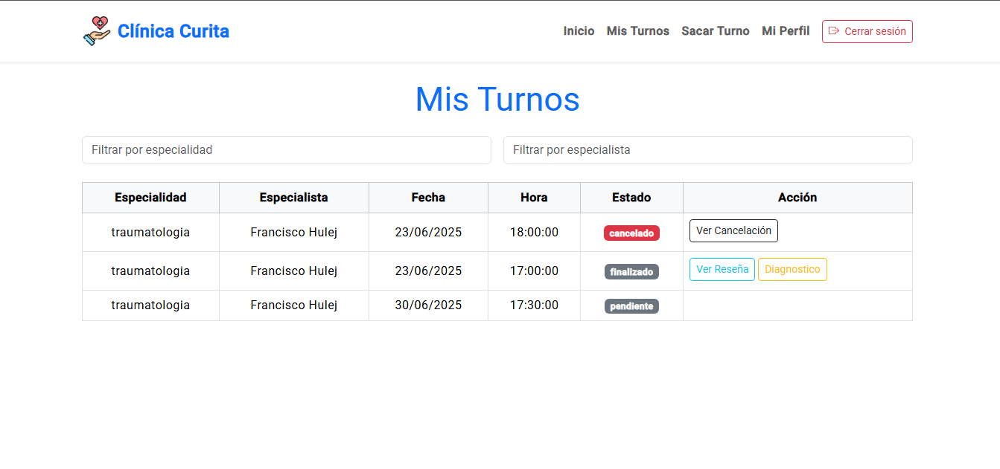

  <b>Especialista</b>

  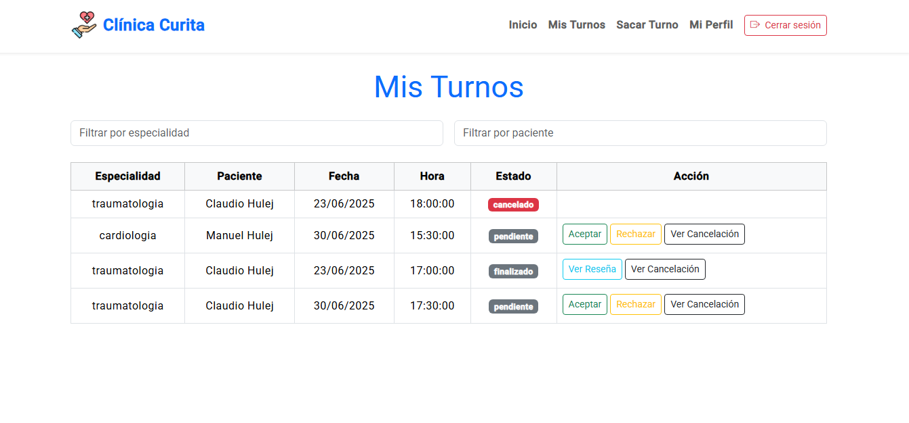

### Descripción

Listado de turnos del usuario logueado (paciente o especialista), con filtros y acciones contextuales.

### Funcionalidades

- Filtros por texto (especialidad, especialista o paciente).
- Acciones según el tipo y estado:
  - Pacientes: cancelar, completar encuesta, calificar atención.
  - Especialistas: aceptar, rechazar, finalizar turno.
- Modal para encuestas y reseñas.

---

## Pantalla: Todos los Turnos (Administrador)

  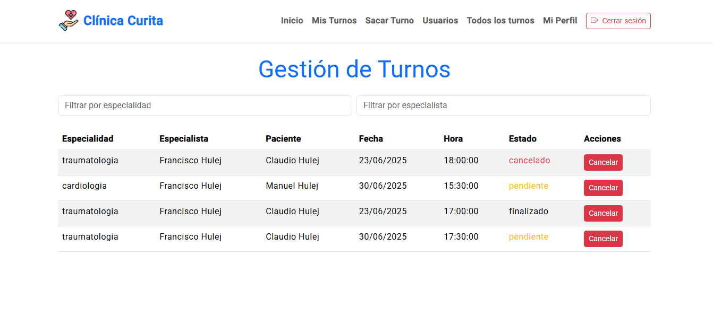

### Descripción

Vista general de todos los turnos en la clínica, accesible solo por el administrador.

### Funcionalidades

- Filtro sin combobox por especialidad y especialista (inputs simples).
- Muestra todos los datos del turno, incluyendo paciente.
- Permite cancelar turnos si no están aceptados, realizados o rechazados, exigiendo un comentario.

### Componentes

- Filtro por texto (FormGroup).
- Tabla con columnas: especialidad, especialista, paciente, fecha, hora, estado.
- Botón para cancelar con confirmación.

---

## Pantalla: Mi Perfil

  <b>Paciente</b>

  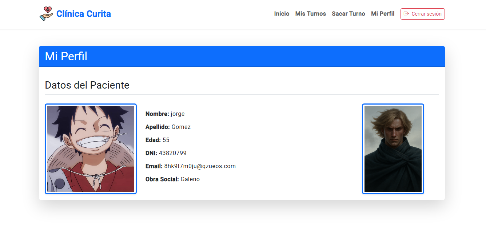

  <b>Especialista</b>

  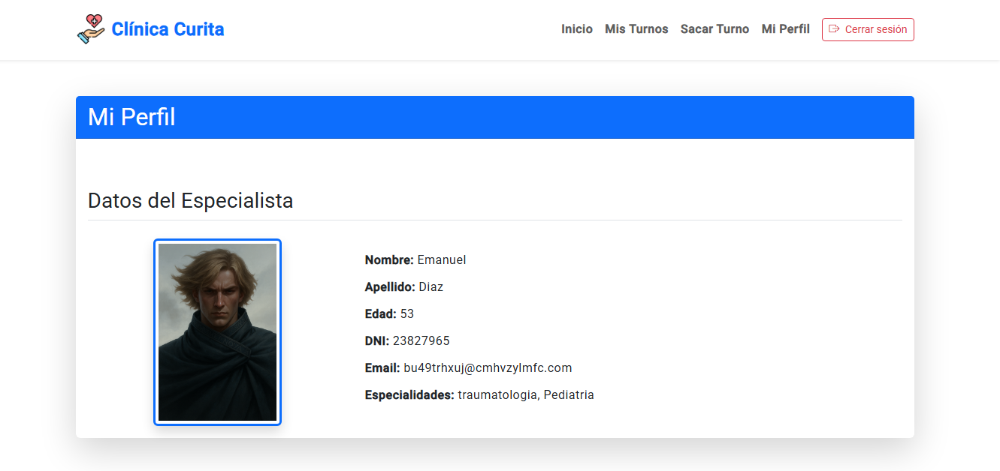

  <b>Administrador</b>

  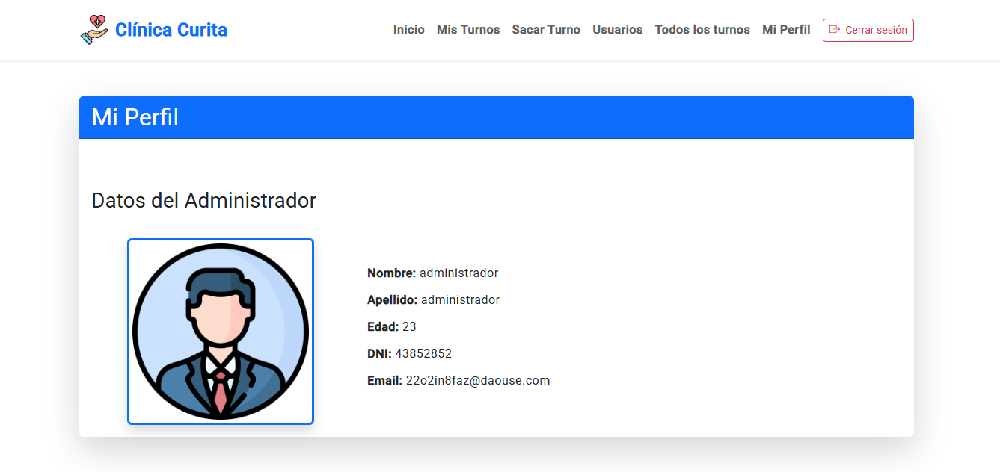

### Descripción

Vista donde el usuario puede consultar y actualizar parte de su información personal, según su rol (paciente, especialista o administrador).

### Funcionalidades

- Muestra los datos del usuario según el rol:
  - **Paciente:** nombre, apellido, edad, DNI, email, obra social, imágenes de perfil.
  - **Especialista:** nombre, apellido, edad, DNI, email, especialidades y imagen de perfil.
  - **Administrador:** datos personales básicos.

---
